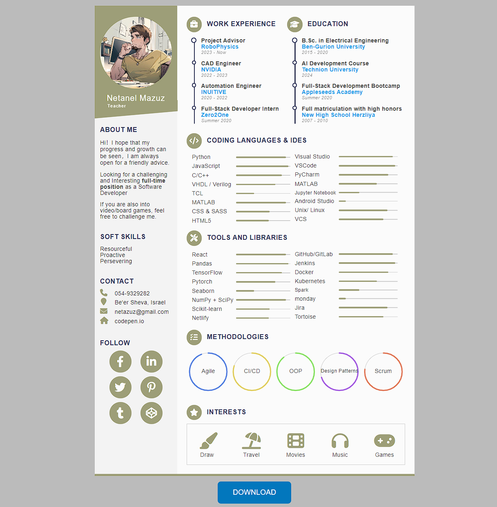

# Interactive CV Webpage

This project is an interactive and visually appealing resume/CV webpage that highlights your professional experience, skills, education, and interests. The webpage is fully responsive, ensuring a great user experience across various devices.

## Preview



## Table of Contents

- [Features](#features)
- [Technologies Used](#technologies-used)
- [Getting Started](#getting-started)
- [Usage](#usage)
- [Project Structure](#project-structure)
- [Customization](#customization)
- [Contributing](#contributing)
- [License](#license)

## Features

- **Responsive Design**: The webpage is optimized for all screen sizes.
- **Interactive UI**: Includes animations and interactive elements to engage users.
- **Clean Layout**: Sections for work experience, education, skills, and interests are clearly organized.
- **Contact Information**: Easily accessible contact details and social media links.
- **Downloadable Resume**: Option to download the CV as a PDF.

## Technologies Used

- **HTML5**
- **CSS3**
- **JavaScript**
- **Font Awesome**: For icons used throughout the webpage.
- **Google Fonts**: For custom font usage.

## Getting Started

### Prerequisites

To view or edit this project, you need a basic understanding of HTML, CSS, and JavaScript. No additional software or libraries are required beyond a modern web browser.

### Installation

1. Clone the repository:

   ```bash
   git clone https://github.com/CodePro-art/onlineCV.git
   ```

2. Navigate to the project directory:

   ```bash
   cd interactive-cv
   ```

3. Open the `index.html` file in your preferred web browser, alternatively, you can use a local development server like Live Server in VS Code.

### Usage

- **Back to Portfolio:** A button to navigate back to your portfolio or main page.
- **Profile Section:** Displays your photo, name, and profession.
- **About Me:** A short introduction and career goals.
- **Soft Skills:** A list of your key personal attributes.
- **Contact Information:** Your phone number, address, email, and personal website.
- **Follow Section:** Links to your social media profiles.
- **Work Experience:** A list of your recent roles and responsibilities.
- **Education:** Information about your educational background.
- **Skills:** A visual representation of your proficiency in various coding languages, tools, and libraries.
- **Methodologies:** An overview of the methodologies and practices you are proficient in.
- **Interests:** Your hobbies and personal interests.
- **Download Button:** Allows users to download your CV.

### Project Structure

<pre>
   interactive-cv/  
   ├── assets  
   │     ├── cv.pdf           # The downloadable CV file  
   │     ├── profile.jpg      # Profile picture used in the CV  
   │     └── preview.png      # Preview image for the readme file  
   ├── index.html             # The main HTML file  
   ├── resume.css             # Stylesheet for the webpage  
   ├── resume.js              # JavaScript file for interactivity  
   ├── profile.jpg            # Profile picture  
   ├── README.md              # Project README file  
   └── LICENSE.md             # License file  
</pre>

### Customization

- **Profile Picture**: Replace `profile.jpg` with your own photo.
- **Contact Information**: Update the contact details in the HTML file.
- **Work Experience**: Modify the work experience section in the HTML file.
- **Education**: Update the education details in the HTML file.
- **Skills**: Customize the skills list in the HTML file.
- **Interests**: Add or remove interests as needed.
- **Download Button**: Adjust the download link in the HTML file.

### Contributing

Contributions are welcome! If you have any suggestions, improvements, or bug fixes, please open an issue or submit a pull request.

### License

This project is licensed under the MIT License - see the [LICENSE](LICENSE) file for details.

### Contact

- Email Address: [netazuz@gmail.com](mailto:netazuz@gmail.com)
- GitHub Profile: [https://github.com/CodePro-art](https://github.com/CodePro-art)
- LinkedIn Profile: [https://www.linkedin.com/in/netazuz/](https://www.linkedin.com/in/netazuz/)